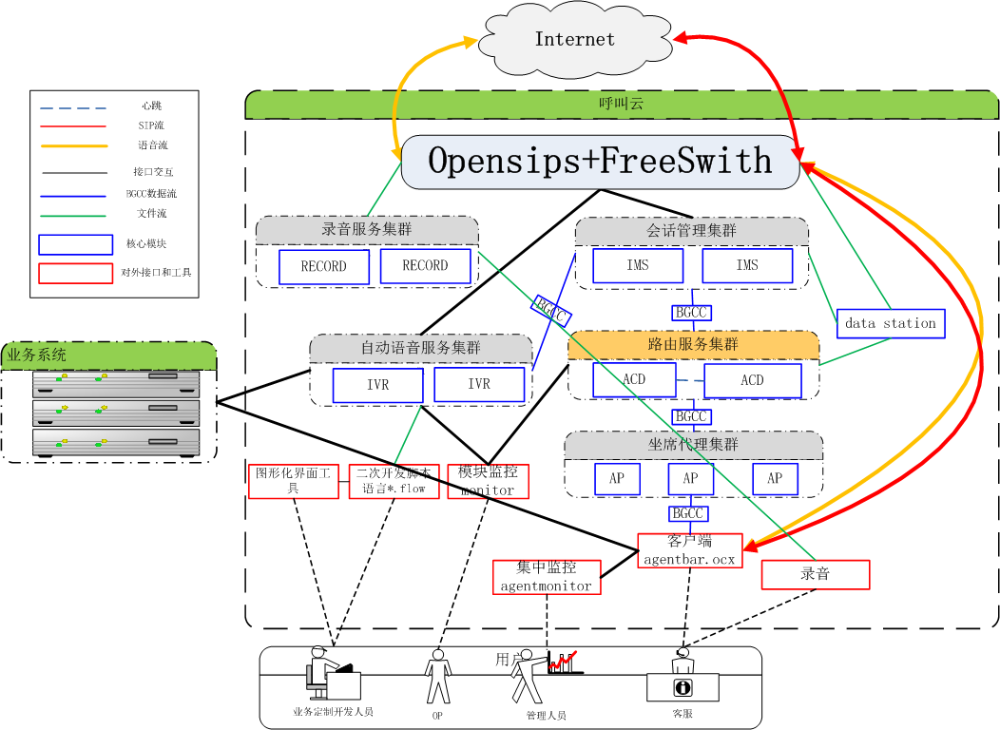
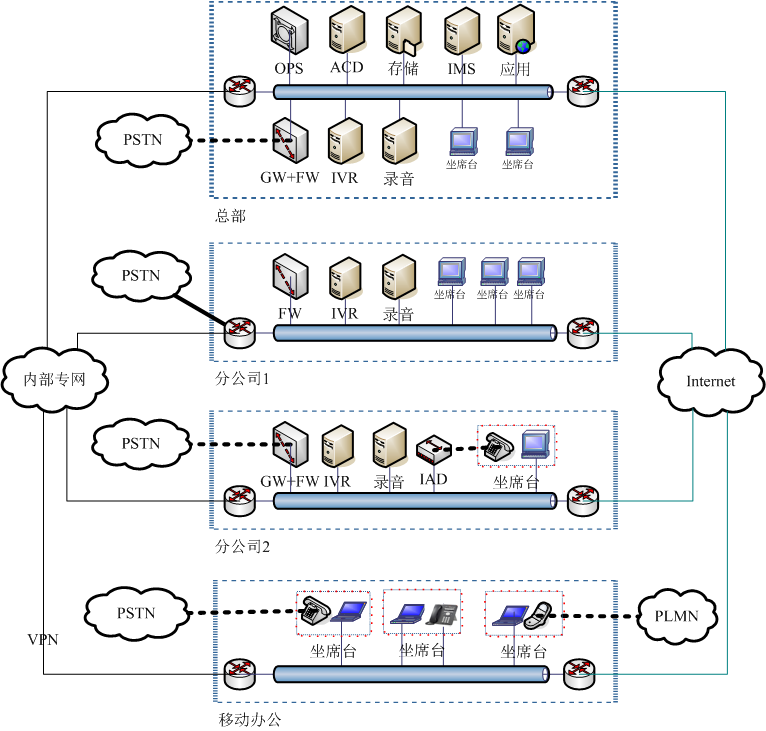

<<<<<<< HEAD
#简介

百度开发的一套基于互联网应用模式的呼叫中心套件，采用颠覆式的技术模式，无需任何专有硬件设备，以通用服务器+软件的模式，依靠云计算等技术，完成语音的交换和呼叫的控制，在大幅降低呼叫中心建设成本的同时，仍然具有无法比拟的高可靠性。

#平台特性
1. 语音通信遵循SIP协议，基于[FreeSWITCH](http://www.freeswitch.org)进行语音接入
2. 呼叫控制遵循CSTAII协议
3. 网络通信使用[BGCC](https://github.com/BaiduCC/BGCC/)组件
4. 通过软件实现高可靠性，降低硬件依赖和成本
5. 完备的二次开发接口和平台
6. 百度内部大规模应用（10000坐席以上），稳定性保持在99.996%以上
7. 后续陆续开放多媒体功能

#软件实现
1. ACD. 坐席登陆和路由服务，提供控件级、接口级二次开发包
2. AP. 坐席接入代理，为ACD分担压力
2. IMS. 统一呼叫模型维护
3. IVR. 自助语音交互平台，提供可视化定制IDE
4. RECORD. 按需/自动进行分布式通话录音

#逻辑架构

#典型组网方案

#人工功能列表
1. 登陆/登出
2. 休息
3. 空闲/忙碌
4. 外呼
5. 应答
6. 挂断
7. 保持/保持接回
8. 咨询/咨询接回/咨询转移/咨询会议
9. 单步转移/单步会议
10. 强插/监听
11. 转IVR
12. 设置/获取随路数据

#IVR功能列表
##呼叫类
1. 应答/挂断
2. 外呼
3. 桥接

##媒体类
1. 放音收号
2. 播放数字、金额
3. 录音
4. 接受按键

##坐席类
1. 申请坐席/转接坐席/取消申请
2. 设置/获取随路数据
 
##计算类
1. 赋值
2. 比较
3. 访问数据库
4. 访问http
5. 读取ini文件
6. json转换
7. 启动/停止定时器
8. 日志

#二次开发手册
1. [agentbar开发手册](./tools/agentbar/doc/develop_manual.pdf)
2. [IVR开发手册](./platform/ivr/doc/develop_manual.pdf)

#编译&&安装
1. [How To INSTALL](./INSTALL.md)

#License
1. [Apache 2.0](./LICENSE)

=======
#简介

百度开发的一套基于互联网应用模式的呼叫中心套件，采用颠覆式的技术模式，无需任何专有硬件设备，以通用服务器+软件的模式，依靠云计算等技术，完成语音的交换和呼叫的控制，在大幅降低呼叫中心建设成本的同时，仍然具有无法比拟的高可靠性。

#平台特性
1. 语音通信遵循SIP协议，基于[FreeSWITCH](http://www.freeswitch.org)进行语音接入
2. 呼叫控制遵循CSTAII协议
3. 网络通信使用[BGCC](https://github.com/BaiduCC/BGCC/)组件
4. 通过软件实现高可靠性，降低硬件依赖和成本
5. 完备的二次开发接口和平台
6. 百度内部大规模应用（10000坐席以上），稳定性保持在99.996%以上
7. 后续陆续开放多媒体功能

#软件实现
1. ACD. 坐席登陆和路由服务，提供控件级、接口级二次开发包
2. AP. 坐席接入代理，为ACD分担压力
2. IMS. 统一呼叫模型维护
3. IVR. 自助语音交互平台，提供可视化定制IDE
4. RECORD. 按需/自动进行分布式通话录音

#逻辑架构

#典型组网方案

#人工功能列表
1. 登陆/登出
2. 休息
3. 空闲/忙碌
4. 外呼
5. 应答
6. 挂断
7. 保持/保持接回
8. 咨询/咨询接回/咨询转移/咨询会议
9. 单步转移/单步会议
10. 强插/监听
11. 转IVR
12. 设置/获取随路数据

#IVR功能列表
##呼叫类
1. 应答/挂断
2. 外呼
3. 桥接

##媒体类
1. 放音收号
2. 播放数字、金额
3. 录音
4. 接受按键

##坐席类
1. 申请坐席/转接坐席/取消申请
2. 设置/获取随路数据
 
##计算类
1. 赋值
2. 比较
3. 访问数据库
4. 访问http
5. 读取ini文件
6. json转换
7. 启动/停止定时器
8. 日志

#二次开发手册
1. [agentbar开发手册](./tools/agentbar/doc/develop_manual.pdf)
2. [IVR开发手册](./platform/ivr/doc/develop_manual.pdf)

#编译&&安装
1. [How To INSTALL](./INSTALL.md)

#License
1. [Apache 2.0](./LICENSE)

>>>>>>> 52366f05890caf1d08efb5cba831089bd4c4b06f
