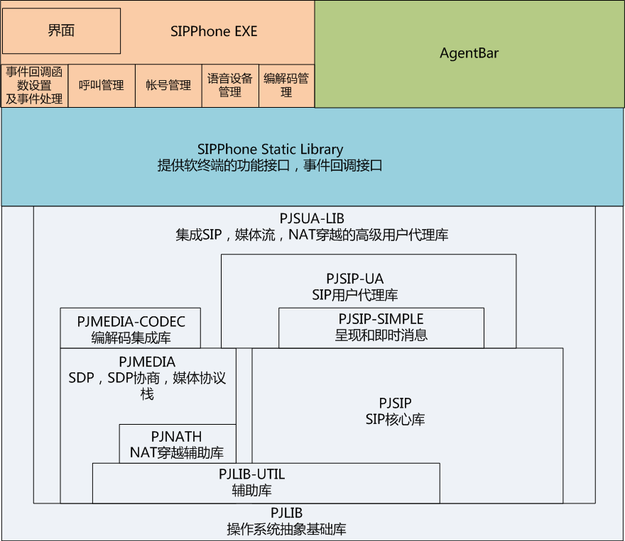

#agentbar
>坐席控制条demo，ActiveX控件，可集成到任何支持ActiveX控件的windows Form程序和浏览器中，支持SIP呼叫。

#monitor
>坐席状态监控demo

#sipphone
>1. SIP协议栈的封装，依赖于[pjsip](http://www.pjsip.org)库，[下载链接](http://www.pjsip.org/release/2.3/pjproject-2.3.zip)
>2. 设计架构
